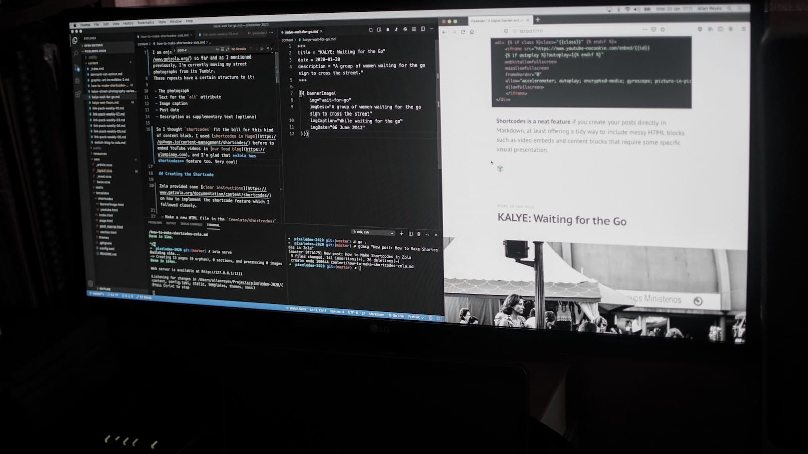

+++
title = "How to Make Shortcodes in Zola"
date = 2020-01-20
description = "Shortcodes is a nifty feature that provides a tidy way to insert messy HTML blocks such as video embeds and content blocks that require some specific visual presentation..."
[extra]
cover_image = "photo-computer-monitor-code-editor.jpg"
alt_text = "Photo of a computer monitor showing a browser and code editor"
+++

I am enjoying rebuilding the site with [Zola](https://www.getzola.org/) so far and as I mentioned previously, I'm currently moving all of my street photographs from its Tumblr.

These reposts have a certain structure to it:

- The photograph
- Text for the `alt` attribute
- Image caption
- Post date
- Description as supplementary text (optional)

So I thought ==shortcodes== could fit the bill for this kind of content block. I used [shortcodes in Hugo](https://gohugo.io/content-management/shortcodes/) before to embed YouTube videos in [our food blog](https://ulampinoy.com), and I'm glad that **Zola has shortcodes** feature too. Very cool!

<!-- more -->

## Creating the Shortcode

Zola provided some [clear instructions](https://www.getzola.org/documentation/content/shortcodes/) on how to implement the shortcode feature which I followed closely.

- Make a new HTML file in the `template/shortcodes/` directory.
- Start with a regular HTML block. In my case, I grabbed the block from a recent post and paste it on the newly created `bannerImage.html`:

```html
<div class="bannerImage kalye">
    <figure>
        
        <figcaption>
            <p class="caption">Wet Floors</p>
            <p class="postdate">05 June 2012</p>
            <blockquote>
                <p>She would yell to anyone approaching the “wet floor” zone. Oh yeah, she did yell at me not to step in to the zone.

                She then afterwards dried the floor by hands – using the “wet floor” sign.
                </p>
            </blockquote>
        </figcaption>
    </figure>
</div>
```
- I then replaced the literal contents with these template variables:
    - `{{ img }}`
    - `{{ imgDesc }}`
    - `{{ imgCaption }}`
    - `{{ imgDate }}`
    - `{{ imgQuote }}` <- this is an optional entry

```html
<div class="bannerImage kalye">
    <figure>
        
        <figcaption>
            <p class="caption">{{ imgCaption }}</p>
            <p class="postdate">{{ imgDate }}</p>
            
            <blockquote>
                <p>
                    {{ imgQuote }}
                </p>
            </blockquote>
            
        </figcaption>
    </figure>
</div>
```

And this is how I use the shortcode for the Tumblr repost in Markdown:

```md
{{ bannerImage(
    img="wait-for-go"
    imgDesc="A group of women waiting for the go sign to cross the street"
    imgCaption="While waiting for the go"
    imgDate="06 June 2012"
)}
```

It's tidier than just dropping the HTML block in Markdown.

I also customized the built-in **shortcode for YouTube videos** to accept two arguments such as the `id` and an optional selector `class`:

```jinja2
<div class="{{class}}" >
    <iframe src="https://www.youtube-nocookie.com/embed/{{id}}
    ?autoplay=1"
    webkitallowfullscreen
    mozallowfullscreen
    frameborder="0"
    allow="accelerometer; autoplay; encrypted-media; gyroscope; picture-in-picture"
    allowfullscreen>
    </iframe>
</div>
```

**Shortcodes is a neat feature** if you create your posts directly in Markdown, at least offering a tidy way to include messy HTML blocks such as video embeds and content blocks that require some specific visual presentation.

<div class="bannerImage">
    
</div>

