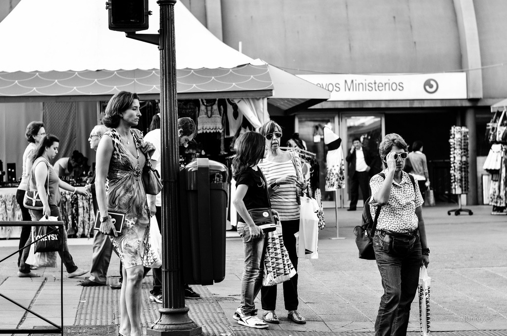

+++
title = "KALYE: Waiting for the Go"
date = 2020-01-20
description = "A group of women waiting for the go sign to cross the street."
[extra]
cover_image = "wait-for-go.jpg"
alt_text = "A group of women waiting for the go sign to cross the street"
+++

    <figure>
        
        <figcaption>
                
A group of women waiting for the go sign to cross the street

                
06 June 2012

        </figcaption>
    </figure>

