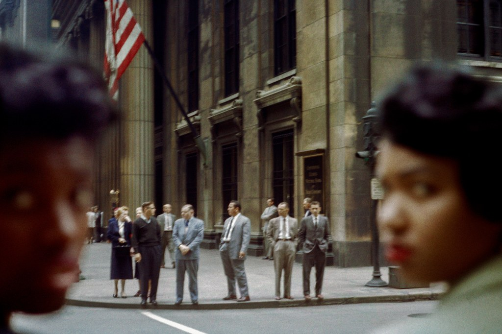

+++
title = "Link Pack Weekly #6"
date = 2020-01-16
description = "Featured: Vivian Maier works in color, MagicaVoxel — 8-bit voxel art editor/GPU, learn about Dark Patterns in websites, how CSS can be used for user tracking, and more..."
[extra]
cover_image = "scott-maier15.jpg"
alt_text = "Photograph by Vivian Maier of two women on the sides of the frame are out of focus and looking at the camera. People stand in between their faces."
+++

    

[WHAT VIVIAN MAIER SAW IN COLOR](https://www.newyorker.com/culture/photo-booth/what-vivian-maier-saw-in-color?verso=true) — an article post showcasing colored photographs by Vivian Maier, one of my favorite street photographer.

> For decades, she supported herself as a nanny in the wealthy enclaves of the city. But her real work was roaming the streets with her camera (often with her young charges in tow), capturing images of sublime spontaneity, wit, and compositional savvy. When pressed about her occupation by a man she once knew, Maier didn’t describe herself as a nanny. *She said, “I am sort of a spy.” All the best street photographers are.*

— via [The New Yorker](https://www.newyorker.com)

📚 **BOOK:** [Vivian Maier: The Color Work](http://www.vivianmaier.com/vivian-maier-books/vivian-maier-the-color-work-book/) — a curated collection of Maier’s color work.

[MagicaVoxel](https://ephtracy.github.io) — a free lightweight 8-bit voxel art editor and GPU based interactive path tracing renderer for Mac and Windows.

[Dark Patterns](https://www.darkpatterns.org) is a site showing how Dark Patterns are being used and how to fall to this canny tricks used in websites and apps that make you do things that you didn't mean to, like buying or signing up for something.

How to make: [Infinite Repeating Dashed Lines in SVG](https://www.maxmin.io/2019/01/21/Infinite-Repeating-Dashed-Lines-in-SVG/)

[Tracking Users with CSS](https://www.templarbit.com/blog/2018/03/20/tracking-users-with-css/) — a post by **Mikey Wills** (via [Templarbit](https://www.templarbit.com)) showing how the ubiquitous CSS can be used to track users and offered some advice on how to protect yourself from XSS attacks and CSS leaks.