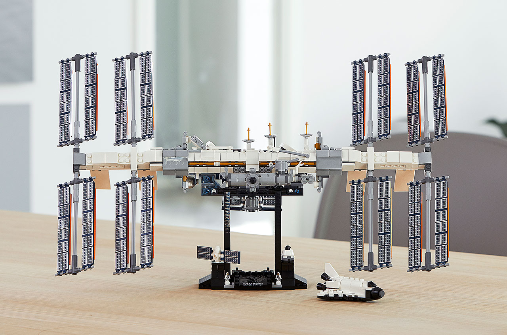

+++
title = "Link Pack Weekly #7"
date = 2020-01-23
description = "Lego ISS, JetBrains Mono font, Neon to generate art piece using 2D vector field, well illustrated post on CSS cascade, AWK, Taal volcano eruption"
[extra]
    cover_image = "photo-lego-model-iss.jpg"
    alt_text = "Lego toy model of the ISS"
+++

Lego is launching an [ISS toy model](http://www.collectspace.com/news/news-012120a-lego-international-space-station.html). Coolness!

[JetBrains Mono](https://www.jetbrains.com/lp/mono/#intro) – A typeface for developers,  it's free, open source monospace font

[The Invention of the Archive](https://daily.jstor.org/the-invention-of-the-archive/)
> Seventeenth-century scholars were horrified by how much ancient knowledge had been lost when the monasteries dispersed.

[Neon](https://neon-v1.netlify.com/) — Generative art piece made using 2d vector field.

[The CSS Cascade](https://wattenberger.com/blog/css-cascade) – How browsers resolve competing CSS styles

Perhaps I am going to learn [AWK](https://blog.jpalardy.com/posts/why-learn-awk/)

[Taal volcano eruption](https://goo.gl/maps/B2x2DQGQyb18WL6i6) spews ash and debris kilometres into the sky.

Photo credit: Domcar C Lagto/PACIFIC P/SIPA/Shutterstock