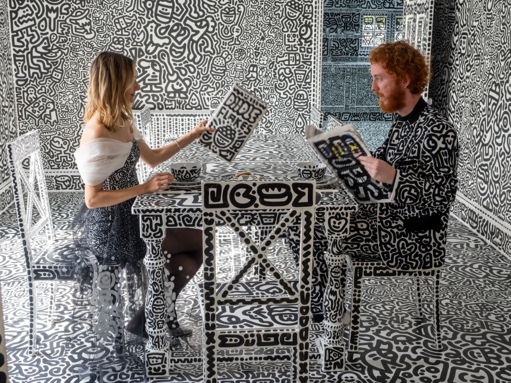
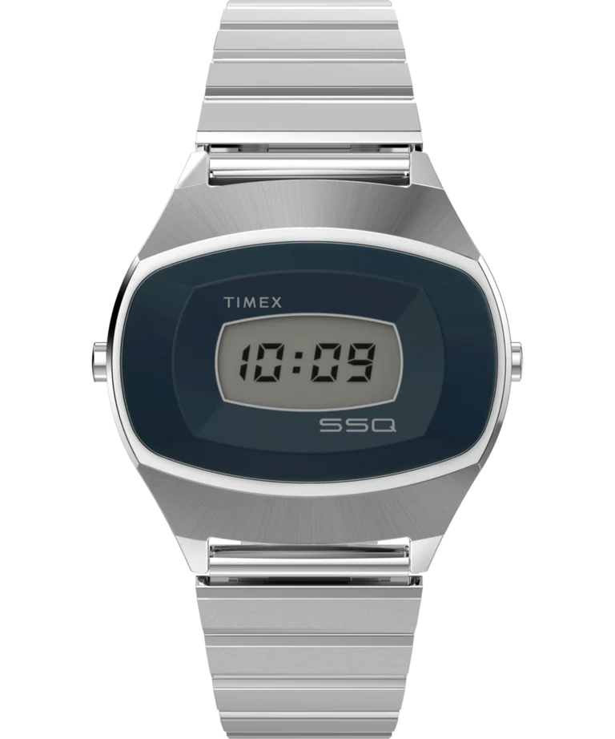
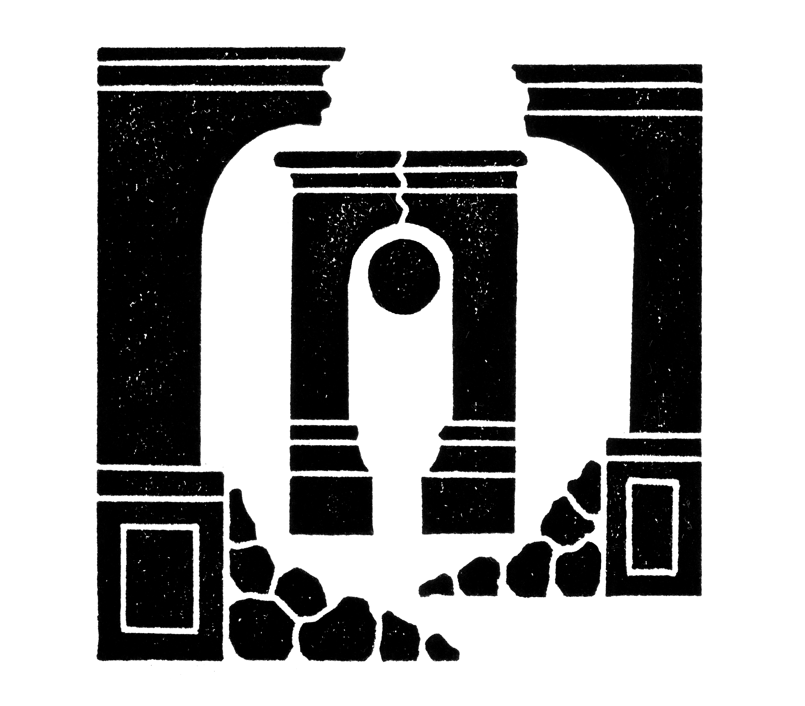

+++
title = "Link Pack Weekly #10"
date = 2025-10-17
description = "Bird migration is changing, artist doodles over entire mansion, Q Timex reissue, super fun Bracket City and more..."
template = "litrato.html"
[extra]
cover_image = "screenshot-bird-migration-changing.png"
alt_text = "Photo of butterfly wing and thermal scans indicating temperature distribution"
+++

## [Bird migration is changing. What does this reveal about our planet? – visualised](https://www.theguardian.com/environment/ng-interactive/2025/oct/16/bird-migration-is-changing-what-does-this-reveal-about-our-planet-visualised-aoe)
Amazing visualization and birds illustrations discussing how climate change is fundamentally altering the timing, routes, and success of bird migration patterns.

{{ wideImage(
    img="1920.avif"
    imgDesc="Illuatration of migrating birds. Copyright: The Guardian"
)}}

Bewick's swan migration from Arctic Russia to north-west Europe [^1]

## [User interfaces of popular websites over the years](https://boingboing.net/2025/10/10/user-interfaces-of-popular-websites-over-the-years.html)
> Jason Kottke made [a graphic showing how YouTube's progress bar has changed](https://kottke.org/25/10/the-evolution-of-the-youtube-progress-bar-2005-2025) in the 20 years since it launched in 2005.

## [Artist squiggles black-and-white doodles over his entire mansion](https://www.nbcnews.com/news/world/mr-doodle-artist-squiggles-black-white-mansion-rcna52453)

“My dream was to have a doodle house and doodle over everything within that house,” Sam Cox said. – via [NBC news](https://www.nbcnews.com/news/world/mr-doodle-artist-squiggles-black-white-mansion-rcna52453)

"Mr. and Mrs. Doodle" at their dining room table. Mo Abbas / NBC News [^2]

> Nothing is spared. Everything outside and inside the house is covered in black-and-white squiggles, a riot of video-game and comic-book inspired cutesy characters. The sofa, the stove, the fridge, the television and even the car parked outside have all been painted on.

## [Q Timex 1975 SSQ](https://timex.com/products/q-timex-1975-ssq-digital-reissue-38mm-stainless-steel-bracelet-watch-tw2y06100?country=US) Digital Reissue

> The Q Timex 1975 SSQ Digital Reissue is a ‘70s LCD trailblazer reimagined for today. Housed in a recycled stainless-steel case, this modern-day reissue is thoughtfully elevated with a sunburst-brushed top and polished case sides, accompanied by a bold navy acrylic lens around the ‘always-on’ LCD display.

## [Bracket City](https://www.theatlantic.com/games/bracket-city/)
> Solve nested clues to reveal a satisfying fact about this day in history. Climb the ranks from tourist to kingmaker (or beyond?). By Ben Gross

An exciting way to flex-start your brain. So much fun! Also, there's the Archive to go back to previous puzzles.

[^1]: Source: Guardian News & Media Limited)

[^2]: Photo credits: https://www.nbcnews.com/news/world/mr-doodle-artist-squiggles-black-white-mansion-rcna52453
