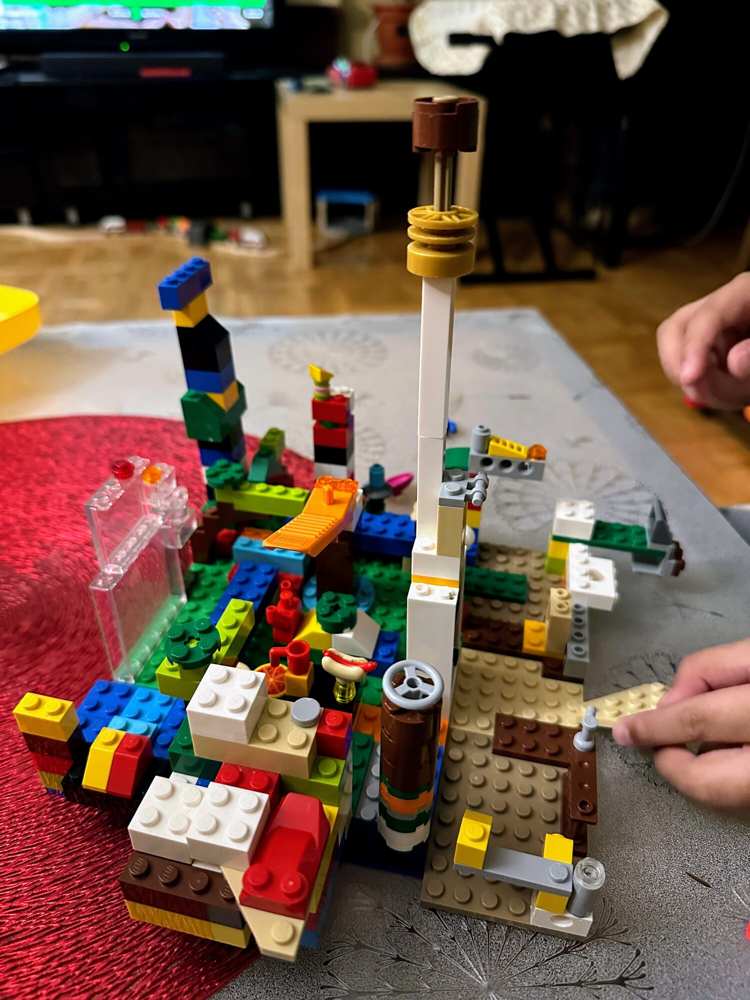

+++
title = "I Killed My Redesign in 62 Seconds"
date = 2026-10-08
description = "Swapping a whole site, framework, build and all, back to its previous version sounds like a weekend of work. On Netlify it was one pull request, one preview and a 62-second build..."
template = "litrato.html"
[extra]
cover_image = "thumbnail.jpg"
alt_text = "A scowling Lego minifigure standing guard on top of a sprawling, many-coloured Lego city"
+++

Earlier this year this site went through a nostalgic redesign. A different framework, a different CSS approach, a different build pipeline and a different output folder structure. This week I reverted all of it to the card grid you're looking at now.

On paper that's a hard change. You're not undoing one commit, you're swapping back the whole stack:

- **From:** Astro + Tailwind, built with `npm run build`, published from `dist/`
- **Back To:** Zola, a single binary, published from `public/`

In practice it was one pull request, one deploy preview and a production build that took **62 seconds**. Here's why it was that easy.

## Your site is your repo

On Netlify, every deploy is built from a commit. So the previous design never really went away. It was still sitting in git history.

The revert just restored that earlier tree: 114 files back in, the Astro scaffolding out. Compared with the old version, exactly one file is different, and that's the build config, which I get to below.

There was no migration and no setup to rebuild. Going back to an old version of the site plainly means going back to an old commit.

## The build config moves with the code

This is the part that would normally be painful. A framework switch usually means changing build settings: a different command, a different publish directory, different environment variables.

With `netlify.toml` in the repo, those settings are part of the commit. Reverting the code reverted the build too. I didn't touch a single setting in the dashboard.

The agent also used the change to tighten two things:

1. **Pin the toolchain.** Download a specific Zola release instead of relying on whatever binary the build image ships, so the same commit always builds the same way.
2. **Keep previews self-contained.** Point Zola's `base_url` at `DEPLOY_PRIME_URL`, so a preview loads its own CSS and images instead of production's.

```toml
[build]
command = "curl -sSfL https://github.com/getzola/zola/releases/download/v${ZOLA_VERSION}/zola-v${ZOLA_VERSION}-x86_64-unknown-linux-gnu.tar.gz | tar xz -C /tmp && /tmp/zola build"
publish = "public"

[build.environment]
ZOLA_VERSION = "0.19.2"

[context.deploy-preview]
command = "curl -sSfL https://github.com/getzola/zola/releases/download/v${ZOLA_VERSION}/zola-v${ZOLA_VERSION}-x86_64-unknown-linux-gnu.tar.gz | tar xz -C /tmp && /tmp/zola build --base-url \"$DEPLOY_PRIME_URL\""

[context.branch-deploy]
command = "curl -sSfL https://github.com/getzola/zola/releases/download/v${ZOLA_VERSION}/zola-v${ZOLA_VERSION}-x86_64-unknown-linux-gnu.tar.gz | tar xz -C /tmp && /tmp/zola build --base-url \"$DEPLOY_PRIME_URL\""
```

## An agent did the work, through a pull request

I didn't write the revert by hand. I described what I wanted to an agent on Netlify, and it came back with a branch and a pull request.

That's what makes it safe. The agent doesn't get a shortcut to production. It goes through the same branch, pull request, preview and merge as anyone else on the team, so everything it changes can be reviewed and undone.

## Check the real thing before you ship it

Every pull request gets a **deploy preview**: a full build of the branch at its own URL. I didn't have to guess whether the old templates, pagination and posts would come back intact. I clicked through the actual built site, and then I merged.

## No in-between state

When I merged, Netlify built the new version and switched production to it in one step, only after the build had fully finished. Deploys are atomic, so files aren't swapped one by one. No visitor got the new HTML with the old CSS, and nobody saw a maintenance page. One request got the old site, and the next got the new one.

## Rollback is one click

Every deploy is immutable and gets its own permalink. Production just points to one of them. If the revert had gone wrong, I'd have opened **Deploys**, picked the last good one and clicked **Publish deploy**. It's instant and doesn't rebuild anything.

Deploys are kept for the site's retention window (90 days here). Beyond that, git still has every version.

## The takeaway

A full stack swap sounds like a migration project. On Netlify it's a pull request:

1. Ask for the change (or write it).
2. Review the deploy preview.
3. Merge.
4. If you change your mind, publish the previous deploy.

<div class="bannerImage portrait">
  <figure>
    
    <figcaption>
      <p>Kids build boldly because every brick clicks off as easily as it clicks on. Easy rollbacks make designers bolder.</p>
    </figcaption>
  </figure>
</div>

Giving audacious designers the freedom to be uninhibited. Undoing a bold radical move takes no more effort than making it.
