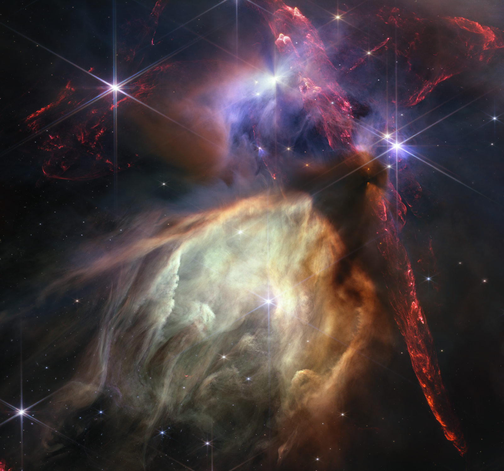

+++
title = "Stellar Nursery"
date = 2023-07-12
description = "The first anniversary image from NASA’s James Webb Space Telescope displays star birth like it’s never been seen before, full of detailed, impressionistic texture..."
template = "litrato.html"
[extra]
cover_image = "rho-ophiuchi.png"
alt_text = "Photo of Rho Ophiuchi cloud complex"
+++

The first anniversary image from NASA’s James Webb Space Telescope displays star birth like it’s never been seen before, full of detailed, impressionistic texture. The subject is the Rho Ophiuchi cloud complex, the closest star-forming region to Earth. It is a relatively small, quiet stellar nursery, but you’d never know it from Webb’s chaotic close-up. Jets bursting from young stars crisscross the image, impacting the surrounding interstellar gas and lighting up molecular hydrogen, shown in red. Some stars display the telltale shadow of a circumstellar disk, the makings of future planetary systems. 

The young stars at the center of many of these disks are similar in mass to the Sun, or smaller. The heftiest in this image is the star S1, which appears amid a glowing cave it is carving out with its stellar winds in the lower half of the image. The lighter-colored gas surrounding S1 consists of polycyclic aromatic hydrocarbons, a family of carbon-based molecules that are among the most common compounds found in space. 

Watch the [video tour](https://webbtelescope.org/contents/media/videos/2023/128/01H4YM4EH20F6ZX6M7EWDE9RSN)

Read the full source at [Webb Space Telescope official website](https://webbtelescope.org/contents/media/images/2023/128/01H449193V5Q4Q6GFBKXAZ3S03?news=true)