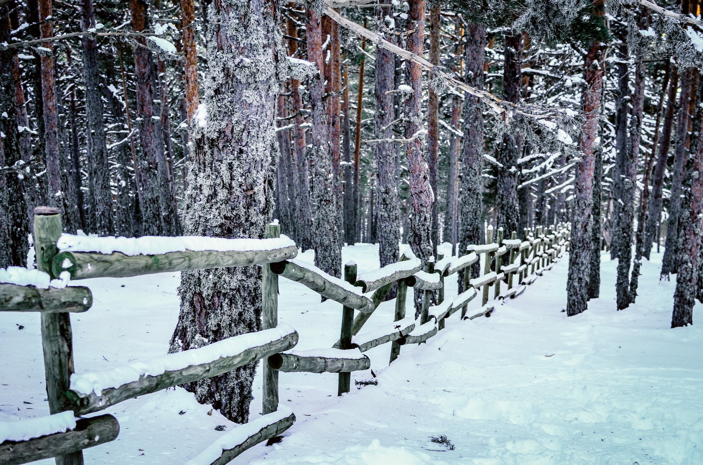
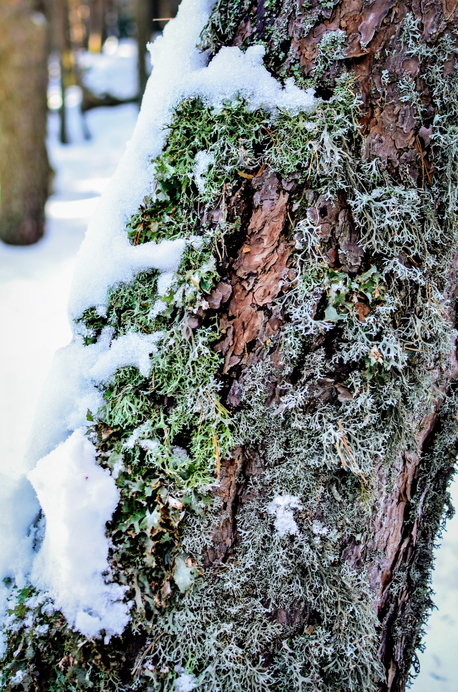
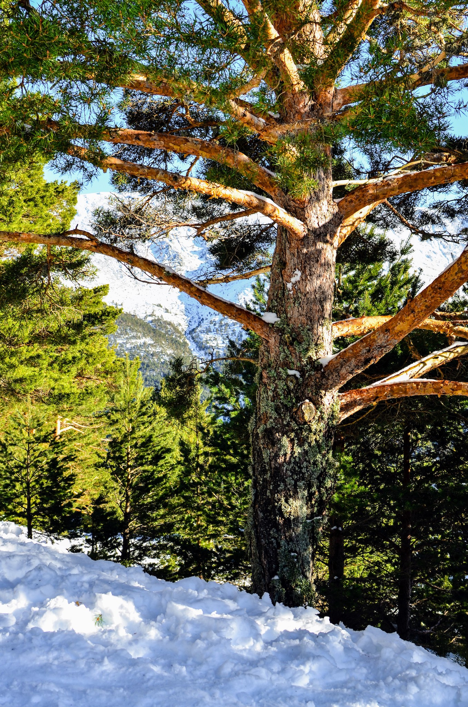
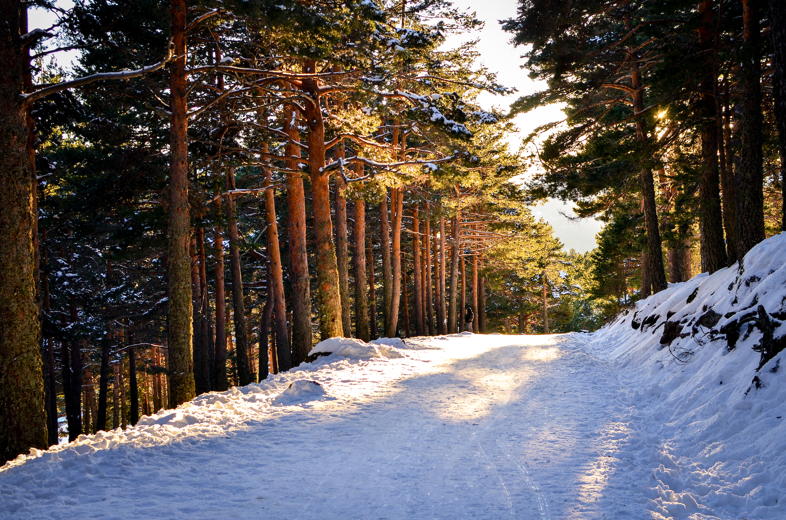
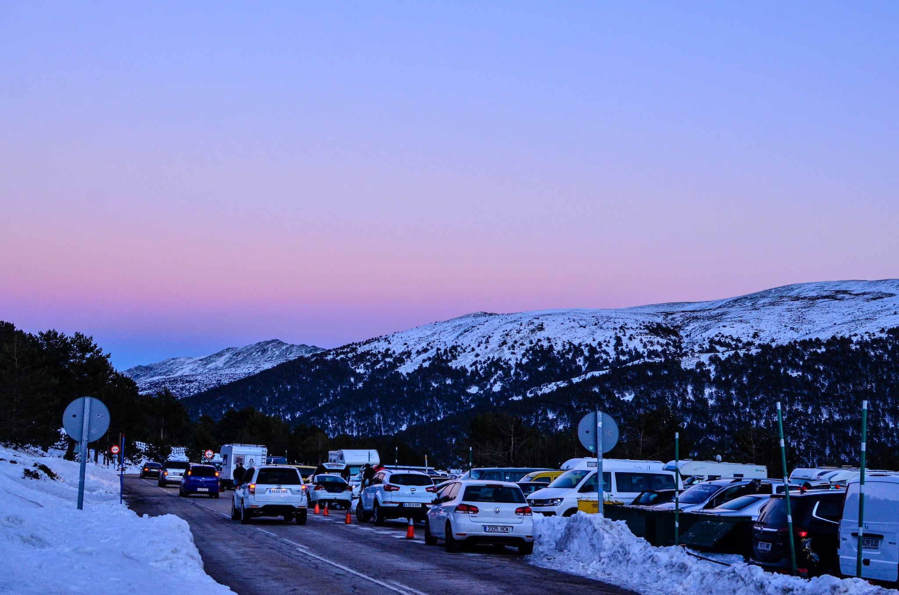

+++
title = "Winter 2016"
date = 2020-02-06
description = "Snow adventures in Madrid's snow mountain in Los Cotos"
[extra]
cover_image = "winter-pathway-pine-frozen.jpg"
alt_text = "Photo of of frozen snowy fence and pine trees"
+++

In the city of Madrid, snow is a rare thing but to experience snow it is just one hour or less drive up to the *sierra de Madrid* or the mountains. But not all winter days are equal. Four years ago was one of the ideal time to experience it!

Hope we get to climb up the snow mountain again soon!
